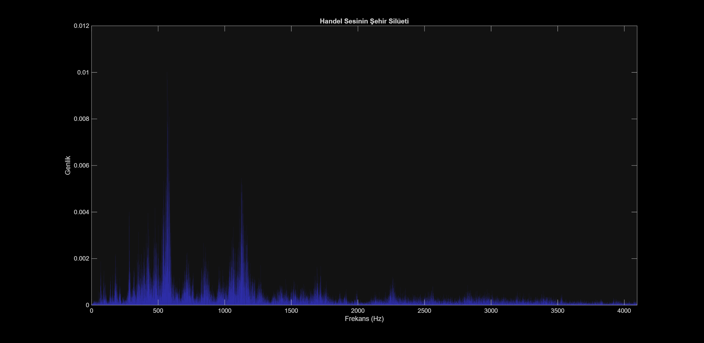

# Handel Ses Görselleştirme 🎶🌆

Bu proje, MATLAB'ın hazır `handel.mat` ses örneğini kullanarak iki farklı görselleştirme üretir:

## 📂 Klasör Yapısı
- 📁 src/ : MATLAB kodları (`handel_visual.m`)
- 📁 data/ : Ses verisi (`handel.mat`)
- 📁 figures/ : Çıktı görselleri (`sehir_silueti.png`, dalga animasyonu isteğe bağlı GIF)
- 📁 docs/ : Ek açıklamalar
- 📄 README.md : Proje tanıtımı
- 📄 LICENSE : Lisans bilgisi

## 🚀 Kullanım
1. MATLAB'da `src/handel_visual.m` dosyasını çalıştırın.
2. `data/handel.mat` dosyası yüklenir ve ses çalınır.
3. Dalga animasyonu MATLAB figür penceresinde oynatılır.
4. Frekans spektrumu (şehir silüeti) görseli `figures/sehir_silueti.png` olarak kaydedilir.

## 📚 Örnek Çıktı
Aşağıda örnek bir çıktı görseli yer almaktadır:

## 📜 Lisans
Bu proje MIT Lisansı altında sunulmaktadır. Ayrıntılar için LICENSE dosyasına bakın.

